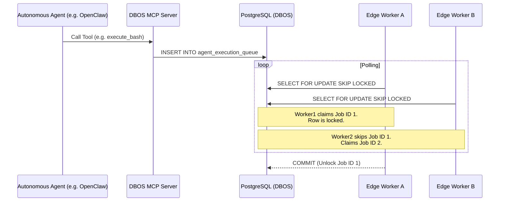
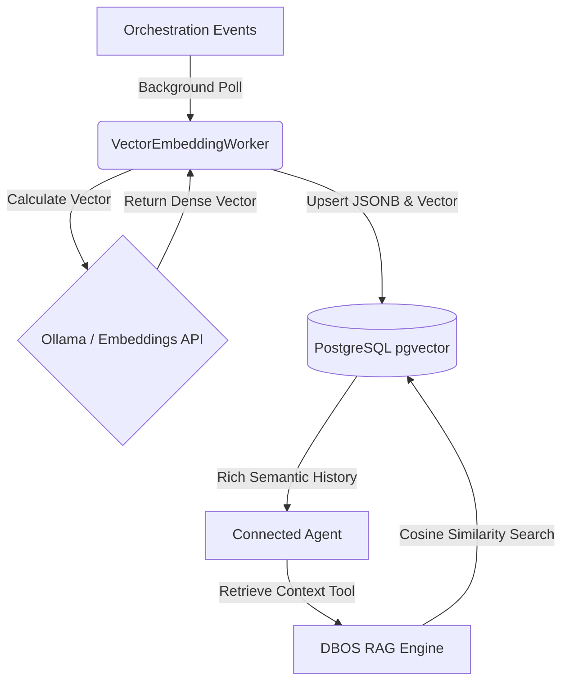

# Architecture: Krusch DBOS MCP

## 1. What Is This?

Krusch DBOS MCP is a highly-concurrent, headless orchestration engine built on a Database-Oriented Operating System (DBOS) architecture. By swapping local, file-bound state for a stateless PostgreSQL model, the engine acts as a robust message bus and capability router. It allows autonomous agents (like OpenClaw or Claude) to execute tools, plan orchestrations, and read files concurrently without lock contention, treating the Postgres database as the central orchestration queue.

## 2. Core Concepts

### DBOS `SKIP LOCKED` Queues

To achieve true stateless concurrency, all agent orchestration loops are handled via Postgres-native job queues. Workers poll for pending tasks using `SELECT ... FOR UPDATE SKIP LOCKED`. This ensures that even if multiple worker containers are running on different compute nodes, a single agentic task is consumed exactly once without deadlocks.

### Unified PostgreSQL Persistence Architecture

The persistence layer relies entirely on a stateless, unified database engine, ensuring massive concurrent scale:

- **Global PostgreSQL Orchestrator**: Implemented via `@effect/sql-pg`. Handles JSONB queuing, multi-node job dispatch, and vector embeddings. By fully migrating away from SQLite or in-memory caches, the DBOS engine enables true horizontal scaling.

### Multi-Node Scalability

The architecture completely decouples the heavy orchestration execution environments into distributed nodes:

- **Database Node:** Hosts the PostgreSQL database with the `pgvector` extension.
- **Compute Node(s):** Runs the stateless Krusch DBOS MCP server and local workers natively or via Docker.
- **Agent Clients:** External autonomous agents connect remotely over the standard Model Context Protocol (MCP) using HTTP/SSE.

### Universal RAG & Vector Embeddings

To maintain semantic awareness across sessions, DBOS natively embeds all execution events to create a global knowledge graph.

- The `VectorEmbeddingWorker` asynchronously calculates `pgvector` embeddings for all orchestration events.
- **Native Project Isolation:** The `VectorEmbeddingWorker` traces events back to their source project ID during embedding. When an agent fetches context, DBOS strictly filters the Postgres vector search by the active project, enforcing hard multi-tenant isolation and preventing context bleed.

## 3. Data Model

The core relational data model revolves around:

- **OrchestrationEvent**: Represents every atomic agent action, thought, tool call, and lifecycle hook.
- **AgentExecutionQueue**: Manages the multi-worker distributed processing state.

## 4. Technical Constraints

- **Stack**: Node.js, Effect-TS
- **Interface**: Model Context Protocol (MCP) via HTTP/SSE
- **Database**: PostgreSQL (with `pgvector` extension)
- **Build / Tooling**: Bun (used for dependency management and execution)
- **Local Directory Standard**: The orchestrator defaults to the local `~/.kd` home directory for configuration caches and session records, aligning with the unified ecosystem namespace.

## 5. Storage Tiering & Performance

To guarantee sub-millisecond database execution and rapid vector similarity searches, the persistence layer uses high-performance storage:
- **NVMe SSD Storage**: All Docker containers, event logs, and the PostgreSQL database (specifically the `kruschdb-postgres-data` volume) reside on the high-speed NVMe SSD mounted at `/mnt/nvme/docker` on `kruschdev`. 
- **Latency Optimization**: By configuring Docker's `"data-root"` directly on the NVMe layer, disk I/O and vector search read/writes are optimized for zero-latency, highly concurrent operations.

## 6. Connectivity & Well-Known Seams

Clients discover server settings, features, and endpoints dynamically:
- **Environment Descriptor (`GET /.well-known/kd/environment`)**: An unauthenticated, public endpoint that provides the active client routing descriptor, server versioning, and environment status.
- **SSE Streaming Gateway (`GET /mcp/sse`)**: Connects headless swarms via robust Server-Sent Events, streaming tool activities and status blocks.

## 7. Deployment

The backend can be easily containerized and distributed via `docker-compose`.

- Ensure `DATABASE_URL` is injected into the container environment.
- The application utilizes an automatic environment discovery system, preventing the strict requirement of static `.env` files in dynamic deployments.
