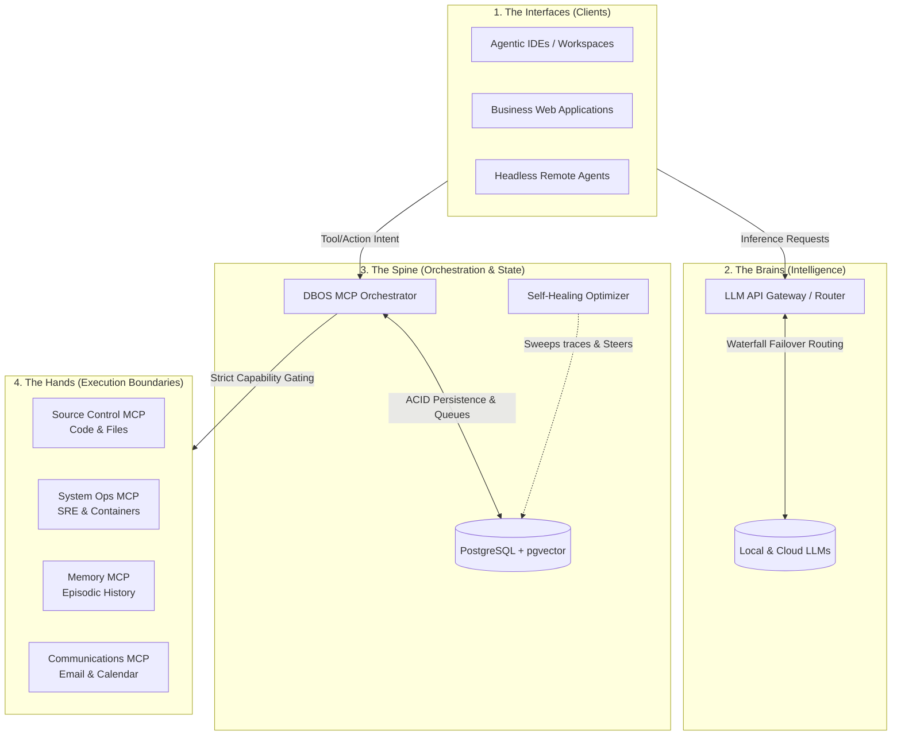

# The DBOS Agentic Ecosystem Blueprint

This document outlines the high-level architecture for building a highly-concurrent, horizontally scalable agentic coding infrastructure using the **Database-Oriented Operating System (DBOS)** paradigm. 

The architecture moves away from monolithic local desktop applications into a highly modular, distributed swarm of specialized services communicating over standard protocols (MCP, SSE, REST).

## The Architecture Map

## The 4 Layers Explained

### 1. The Interfaces (Clients)
This is where developers or autonomous agents initiate work. It includes daily drivers (like AI-native IDEs), specialized business web platforms that leverage agents under the hood, and external autonomous background loops operating on edge nodes.

### 2. The Intelligence Layer (LLM Gateway)
The central "LLM switchboard." It receives prompts from the clients and handles multi-provider waterfall routing. If a local CUDA node is overloaded or unavailable, it seamlessly fails over to cloud providers (e.g., OpenRouter, Gemini, Anthropic). It is strictly responsible for managing API keys, inference, and executing complex prompt structuring (like Thinker/Implementer architectures).

### 3. The Orchestration Layer (DBOS MCP)
*This repository.* It acts as the central nervous system. When an AI decides it wants to *do something*, it sends the request here. DBOS validates the request against strict security boundaries, queues the job atomically in PostgreSQL (`SKIP LOCKED`), and logs the execution trace for long-term vector recall. It natively supports self-healing feedback loops (like **HALO**) that learn from agent failures overnight to generate behavioral nudges that steer future context.

### 4. The Execution Boundaries (The Synapses)
DBOS does not inherently have root access to the host machine. Instead, it delegates approved actions to highly specialized, isolated Model Context Protocol (MCP) servers. DBOS treats these like plugins:
- **Source Control MCP**: The only service allowed to edit code or make Git commits.
- **System Ops MCP**: The SRE bot that monitors fleet health and safely bounces containers.
- **Communications MCP**: The secure bridge to personal data (Email, Slack, Calendar) that prevents agents from accessing raw databases directly.
- **Memory MCP**: The database manager that handles project-isolated episodic memories and temporal decay.

## 🧠 The Agentic Brain: Infinite Continuity

A native AI IDE (like Antigravity or Claude) suffers from the **"Goldfish Memory"** problem—it loses all context the moment a chat session is cleared. It forgets *why* architectural decisions were made and *how* previous bugs were solved.

The DBOS ecosystem solves this by connecting the agent to two distinct memory hemispheres:

1. **Source Control MCP (The "What" and "How")**: Acts as the structural memory. Instead of blindly `grep` searching, the agent queries the codebase semantically to understand the physical structure and implementation patterns.
2. **Memory MCP (The "Why")**: Acts as the episodic and procedural memory. When the agent solves a difficult bug or the developer makes a high-level architectural decision, it permanently saves that "Nugget" into a vector database.

**The Synthesis:** When the agent starts a new session, it queries the Memory MCP to recall the *intent*, and queries the Source Control MCP to see *how* it is currently implemented. By combining Procedural Memory with Structural Memory, the agent achieves infinite continuity across infinite sessions.

## 🔌 Integration: IDE vs. Headless Agents

The DBOS Ecosystem treats all intelligence as clients, but the integration pattern differs based on autonomy:

- **IDE Agents (Antigravity, Claude)**: 
  - **The Human is the Orchestrator.** The developer sits at the wheel. The IDE connects to the DBOS MCP boundaries locally (via `stdio`). The AI acts as an extremely context-aware assistant, pulling from Memory and PG-Git to write code in the developer's active workspace.
- **Headless Agents (OpenClaw, Hermes, Edge Nodes)**: 
  - **The AI is the Orchestrator.** These agents run completely autonomously in the background. They connect to the **Krusch Agentic Proxy** (via REST) for their LLM reasoning, and to the **DBOS MCP** (via HTTP/SSE) for tool execution. Because they have no human to guide them, they rely entirely on the DBOS capability boundaries for safety and the Memory MCP to maintain their state loops over time.

### The Foundation (Shared Tooling)
To maintain security and stability across a distributed ecosystem, it is highly recommended to glue everything together with internal shared utility libraries. This guarantees that every node and standalone app utilizes the exact same authentication middleware, database connection pooling, and streaming logic.
