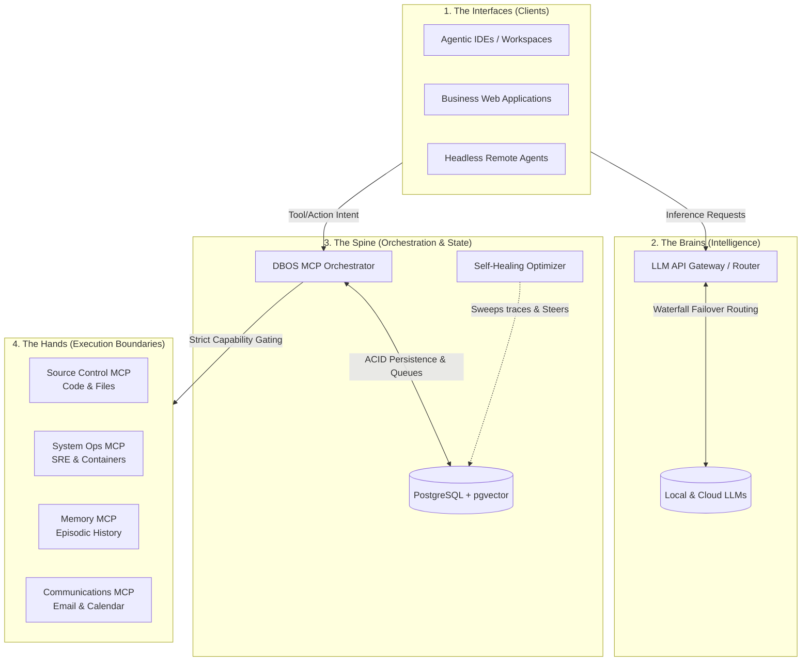

# The DBOS Agentic Ecosystem Blueprint

This document outlines the high-level architecture for building a highly-concurrent, horizontally scalable agentic coding infrastructure using the **Database-Oriented Operating System (DBOS)** paradigm. 

The architecture moves away from monolithic local desktop applications into a highly modular, distributed swarm of specialized services communicating over standard protocols (MCP, SSE, REST).

## The Architecture Map

## The 4 Layers Explained

### 1. The Interfaces (Clients)
This is where developers or autonomous agents initiate work. It includes daily drivers (like AI-native IDEs), specialized business web platforms that leverage agents under the hood, and external autonomous background loops operating on edge nodes.

### 2. The Intelligence Layer (LLM Gateway)
The central "LLM switchboard." It receives prompts from the clients and handles multi-provider waterfall routing. If a local CUDA node is overloaded or unavailable, it seamlessly fails over to cloud providers (e.g., OpenRouter, Gemini, Anthropic). It is strictly responsible for managing API keys, inference, and executing complex prompt structuring (like Thinker/Implementer architectures).

### 3. The Orchestration Layer (DBOS MCP)
*This repository.* It acts as the central nervous system. When an AI decides it wants to *do something*, it sends the request here. DBOS validates the request against strict security boundaries, queues the job atomically in PostgreSQL (`SKIP LOCKED`), and logs the execution trace for long-term vector recall. It natively supports self-healing feedback loops (like **HALO**) that learn from agent failures overnight to generate behavioral nudges that steer future context.

### 4. The Execution Boundaries (The Synapses)
DBOS does not inherently have root access to the host machine. Instead, it delegates approved actions to highly specialized, isolated Model Context Protocol (MCP) servers. DBOS treats these like plugins:
- **Source Control MCP**: The only service allowed to edit code or make Git commits.
- **System Ops MCP**: The SRE bot that monitors fleet health and safely bounces containers.
- **Communications MCP**: The secure bridge to personal data (Email, Slack, Calendar) that prevents agents from accessing raw databases directly.
- **Memory MCP**: The database manager that handles project-isolated episodic memories and temporal decay.

### The Foundation (Shared Tooling)
To maintain security and stability across a distributed ecosystem, it is highly recommended to glue everything together with internal shared utility libraries. This guarantees that every node and standalone app utilizes the exact same authentication middleware, database connection pooling, and streaming logic.
