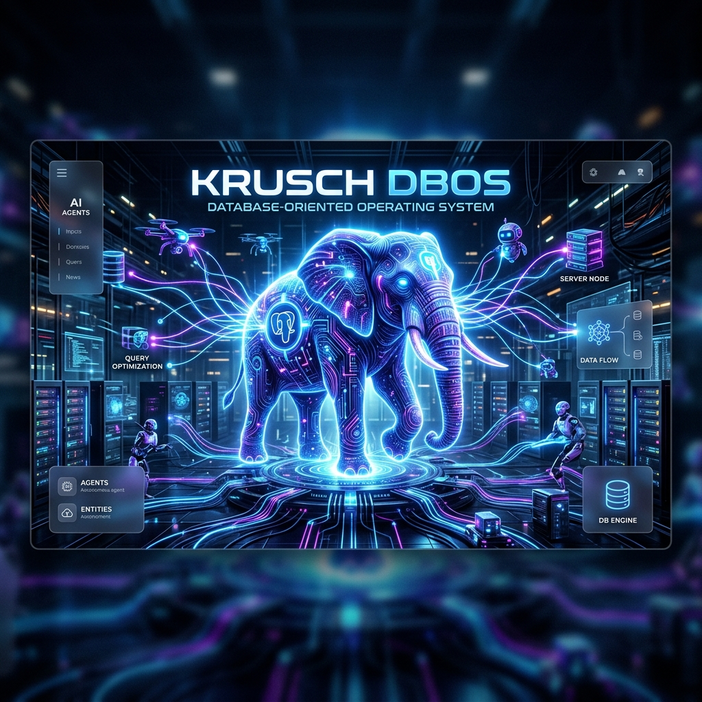

# Krusch DBOS (Headless MCP Orchestrator)

<p align="center">
  
</p>

> A secure, headless orchestration engine for AI agents. Provides ACID-compliant state persistence and strict, capability-gated routing for Model Context Protocol (MCP) tool execution.

An ultra-concurrent, horizontally scalable agentic coding infrastructure built entirely around the **Database-Oriented Operating System (DBOS)** paradigm.

[](https://opensource.org/licenses/MIT)


-lightgrey.svg>)

## 🧠 What Problem Does This Solve?

Traditional AI agent workflows suffer from three critical structural flaws:
1. **The "Goldfish Memory" Context Problem**: Ephemeral execution loops mean an agent starting a new session has absolute amnesia. It has no memory of why custom architectures exist, where database volumes reside, or what specific testing constraints are required.
2. **Concurrency & Coordination Chaos**: When multiple autonomous agents run simultaneously, they lack a shared synchronization plane. They run over each other’s file edits, trigger race conditions in database locks, or duplicate expensive computation.
3. **The "Shadow MCP" Security Threat**: Granting agents raw shell or unchecked tool access exposes host systems to devastating risks. There is no centralized boundary to auditably gate and restrict destructive actions.

**Krusch DBOS MCP** solves these bottlenecks by transforming ephemeral AI execution into an **ACID-compliant, database-driven operating system**. By migrating the orchestration logic and state machines out of memory and into a high-performance PostgreSQL backend (leveraging the NVMe SSD storage), all agent reasoning, queuing, and tool routing are persisted as auditable relational transactions.

---

## 🚀 Why Use It as Part of Our System?

Within our developer and homelab ecosystem, **Krusch DBOS MCP** acts as the central **Swarm Coordinator**. You should always use it as the anchor of our development stack because:

### 1. Mandatory Context Anchoring (Zero-Trust memory)
DBOS integrates directly with the **`krusch-context-mcp`** memory plane. Under our **Zero-Trust Context Verification** rule, every agent is strictly forbidden from guessing context. By executing a Vector VDB query on start, the agent pulls active codebase realities, nightly lessons, and trace histories—eliminating hallucinations and ensuring total continuity.

### 2. High-Performance concurrency (`SKIP LOCKED` queues)
Instead of blocking or leaking resources, agents communicate through native, low-latency queues. Multi-agent deployments use PG `SELECT ... FOR UPDATE SKIP LOCKED` to pull tasks cleanly and safely, ensuring that execution tasks are completed exactly-once without lock contention.

### 3. Closed-Loop Self-Healing (HALO Loop)
The integrated `HaloOptimizerService` runs a local-first trace sweep. If an agent fails a task, the HALO optimizer synthesizes the execution failure into an actionable, durable behavioral nudge (a "**Nugget**") stored in the database. When the agent resumes or a new agent takes over, the model is dynamically steered away from repeating the same mistake.

### 4. Zero-Trust Security Gateway
All interactions pass through the DBOS Capability Gateway. Dangerous operations are isolated, programmatically logged to the database plane prior to dispatch, and securely routed to boundary agents that explicitly forbid destructive actions.

## 🤝 Swarm Orchestration (Ecosystem Synergy)

Krusch DBOS MCP is the central orchestration router of the KruschDev ecosystem. It receives high-level intents from autonomous clients (like OpenClaw or Claude) and seamlessly routes the specialized tool calls to isolated boundary servers:

- **Krusch DBOS MCP (The Orchestrator)**: The overarching Swarm Director. Enforces security boundaries and maintains the Postgres queues.
- **Krusch Infra MCP (The Mechanic)**: Provides read-only monitoring and safe container bouncing.
- **Krusch Memory MCP (The Archivist)**: Provides persistent episodic memory and project context.
- **PG-Git (The Coder)**: Edits files, writes code, and commits changes safely based on DBOS plans.

> 🗺️ **Want to see the big picture?** Read [The Krusch Stack Ecosystem](./ECOSYSTEM.md) for a complete diagram of how the LLM Proxy, DBOS, and all MCP boundaries fit together.

## 🧠 Centralized Proxy Routing & Pinned Model Strategy

To prevent GPU VRAM memory thrashing and latency spikes caused by constant model weight swapping (e.g., swapping between code-generation, critic, and agent execution model parameters), the system supports a standardized **model pinning strategy** coupled with a high-performance **routing proxy**:

1. **Standardized Model Selection**:
   - Swarm configurations can standardize on a designated **primary inference model** (e.g., a balanced 8B or 9B parameter model).
   - Pinning a primary model to dedicated hardware interfaces ensures the weights reside permanently in VRAM, eliminating loading overhead and enabling sub-second inference turnarounds.

2. **Unified Routing Proxy**:
   - All HTTP/SSE completions traffic is dispatched to a centralized **gateway proxy** (e.g., configured via the `OLLAMA_URL` endpoint).
   - The proxy acts as a centralized gatekeeper that dynamically routes standard swarm tasks over the local network to primary high-performance inference nodes, while reserving auxiliary compute interfaces for heavy code-generation tasks or specialized model profiles.

## 🛡️ Agent Guardrails & Secure Access

If you connect a headless agent to the DBOS MCP, **it does not get unrestricted root access to your computer**. The system is built around strict security protocols:

1. **Targeted Workspace Scoping**: Filesystem tools (`read_file`, `edit_file`) are explicitly jailed. A rogue agent cannot traverse up the file tree to read `/etc/shadow`.
2. **Governable Tool Sets**: DBOS abstracts capabilities into strictly defined MCP tools. All operations are synchronously logged to PostgreSQL before execution, allowing for programmatic halting if a malicious command is detected.
3. **Delegated Destructive Boundaries**: The DBOS orchestrator itself does not hold root privileges. Requests for dangerous actions are routed to boundary servers that natively hard-block destructive commands.

## ⚡ Quick Start

### Prerequisites

- Node.js & Bun (`bun >= 1.0.0`)
- Docker & Docker Compose (for PostgreSQL + `pgvector`)

### 1. Boot the Database Layer

```bash
docker compose up -d
```

### 2. Install & Bootstrap

```bash
bun install
# Run database migrations and bootstrap schema
bun run dev:server --migrate
```

### 3. Connect Your Agents

You can dynamically add downstream MCP servers to DBOS by editing the `~/.kd/mcp.json` file. DBOS will automatically discover them, aggregate their safe tools, and present a unified capability list to any connected MCP client.

---

## 🛠️ Configuration

Copy `.env.example` to `.env` and configure accordingly:

- **`DATABASE_URL`**: Primary PostgreSQL connection string (e.g., `postgres://user:password@db:5432/my_database`).
- **`OLLAMA_URL`**: Local embedding configuration used by the `VectorEmbeddingWorker` (e.g., `http://localhost:11434`).

---

## 🗄️ API & Connectivity Layer

The backend exposes a standard Model Context Protocol interface:

- `GET /mcp/sse`: Connects autonomous agents (like OpenClaw) to the DBOS MCP Server via Server-Sent Events (SSE).
- `POST /mcp/messages`: Receives and executes JSON-RPC tool messages from MCP clients.
- `GET /.well-known/kd/environment`: Emits public server configuration and routing capabilities.

---

## 🏗️ Architecture

For a deep dive into the DBOS queuing model and sequence diagrams, please read [ARCHITECTURE.md](./ARCHITECTURE.md).

## 📦 Maintenance & Migrations

### Namespace Migration Checklist (T3 -> KD)

To prevent namespace drift and ensure consistency across the homelab when migrating legacy T3 references to the KD (kruschdev) standard, ensure the following steps are followed:

- [x] **Rename Dotfiles**: Migrate root namespace folders (e.g., `.t3` -> `.kd`).
- [x] **Standardize ENV Variables**: Prefix all custom environment variables with `KD_`.
- [x] **Update Project Configs**: Scan `package.json`, `docker-compose.yml`, and `systemd` services for old namespace strings.
- [x] **Check Telemetry Logs**: Ensure telemetry tools correctly enumerate all modified files during migrations.
- [x] **Pre-commit Validation**: Run a full test and lint suite (`bun run test`) before committing namespace changes.

## License

This project is licensed under the MIT License - see the [LICENSE](./LICENSE) file for details. Created by [kruschdev](https://github.com/kruschdev).
